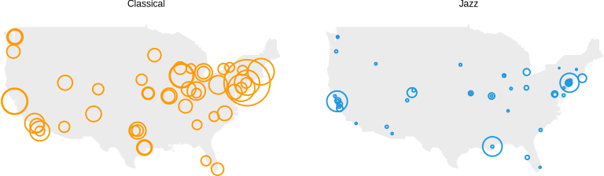

## Welcome to Retrograde Analytics

We are a data research and analytics firm that perfroms data tasks and projects for nonprofit organizations and small businesses whose work benefits arts/culture, science, enviornmentalism, sustainability, civics, and education in order to harness the power of data for the greater good.

!!!




### Markdown

Markdown is a lightweight and easy-to-use syntax for styling your writing. It includes conventions for

```markdown
Syntax highlighted code block


# Header 1
## Header 2
### Header 3

- Bulleted
- List

1. Numbered
2. List

**Bold** and _Italic_ and `Code` text

[Link](url) and 
```


