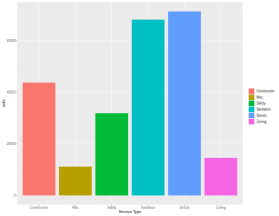
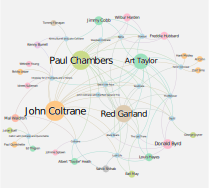
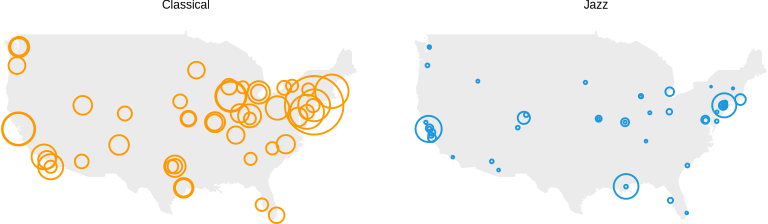
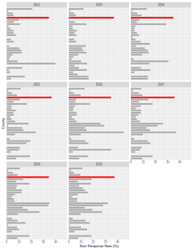

# Welcome to Retrograde Analytics

We are a data research and analytics firm that perfroms data tasks and projects for nonprofit organizations and small businesses whose work benefits arts/culture, science, enviornmentalism, sustainability, civics, and/or education in order to harness the power of data for the greater good.

We specialize in:
- data collection
- network analysis
- geospatial data
- interactive dashboard creation
- customized research
- predictive algorithms

# Examples

## Arrests per Day in Philadelphia

  
</a>

## Judge Non-vote Rate in Philadelphia Study

## 311 Calls in Philadelphia Study

## Network Analysis of John Coltrane's Prestige Years

## Jazz vs Classical Funding Study

## Juror Non-response Rates in PA by County Study

# Contact

Our team can be reached at retrogradeanalytics@gmail.com
